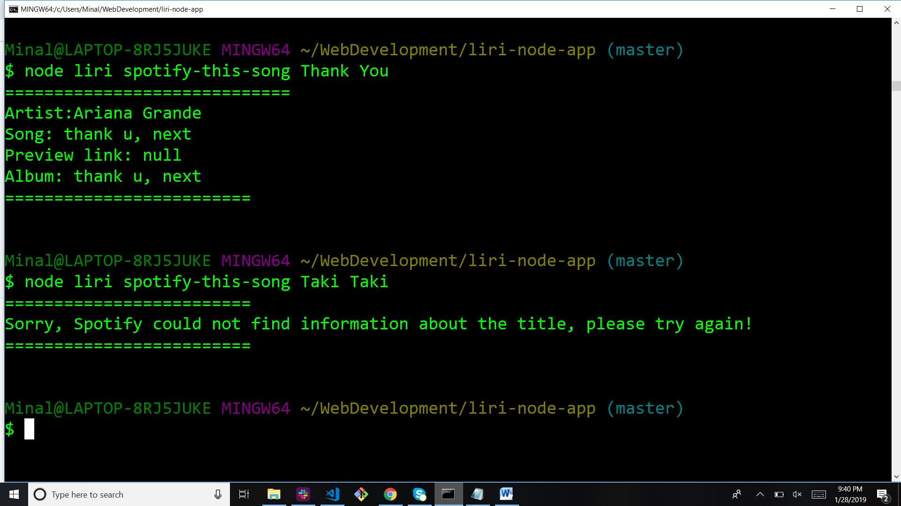
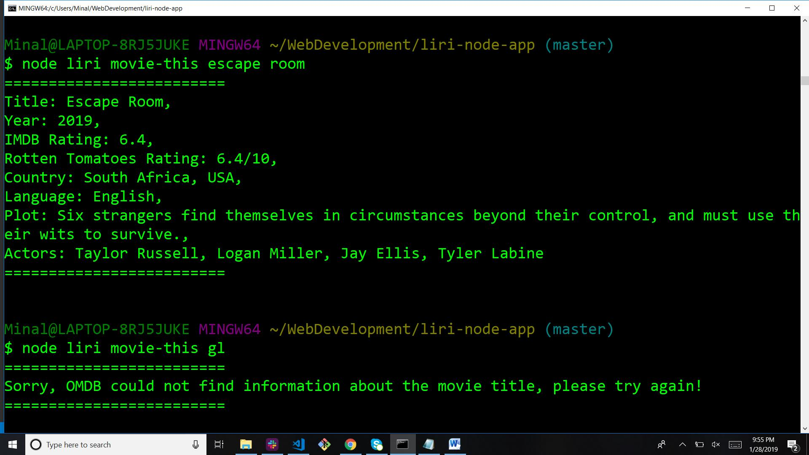
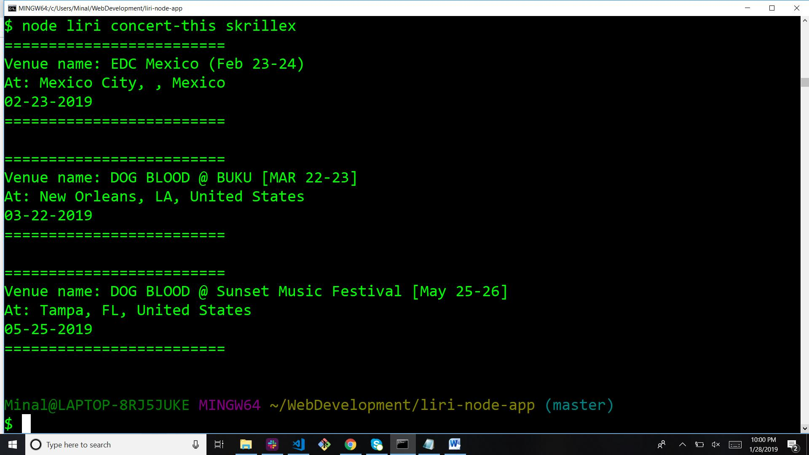
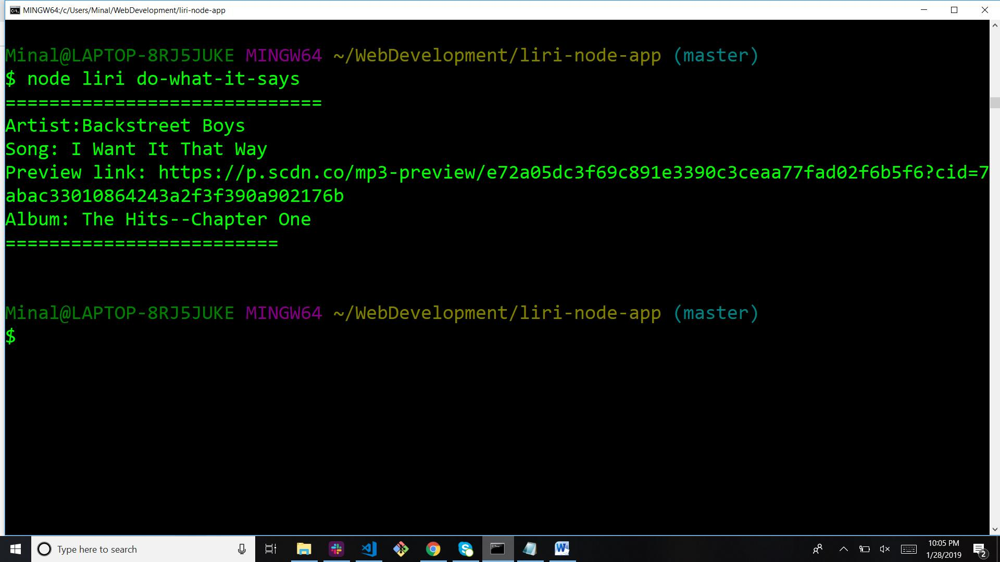

# liri-node-app
LIRI is like iPhone's SIRI. However, while SIRI is a Speech Interpretation and Recognition Interface, LIRI is a _Language_ Interpretation and Recognition Interface. LIRI is a command line node app that takes in parameters and gives you back data.

liri can take in one of the following commands:

   * node liri.js spotify-this-song '<song name here>'

   * node liri.js movie-this '<movie name here>'

   * node liri.js concert-this <artist/band name here>

   * node liri.js do-what-it-says
   
   **node liri.js spotify-this-song<song name here>**
  Liri will retrieve song information like Artist(s), The song's name, A preview link of the song, The album of song from the Spotify API 
  

  
  **node liri.js movie-this '<movie name here>'**
  This will search the OMDB API for the movie and render Title of the movie,Year the movie came out,IMDB Rating of the movie,Rotten           Tomatoes Rating of the movie,Country where the movie was produced,Language of the movie,Plot of the movie,Actors in the movie.
  
  
  
  **node liri.js concert-this <artist/band name here>**
  This will search the Bands in Town Artist Events API for an artist and render 'Name of the venue','Venue location' and 'Date of the         Event' about each event
  
    

   **node liri.js do-what-it-says**
   Using the `fs` Node package, LIRI will take the text inside of random.txt and then use it to call spotify-this-song "I Want it That        Way," as follows the text in `random.txt`.

     
     
[Screenshot](images/random.jpg)
